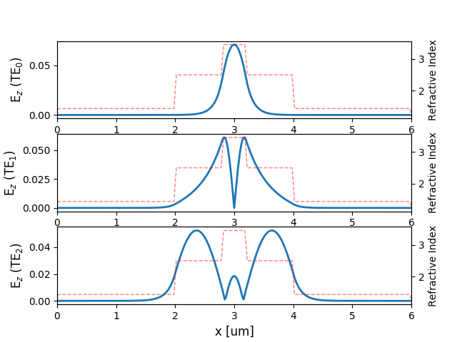

.. _tutorial_1D_mode_solution:

##################################
Solving for modes of 2D Waveguides
##################################

A key component in many electromagnetic simulations (and in particular in
photonics) is the waveguide. When simulating waveguiding structures, it is
typically desirable to excite the structure by injecting a particular mode of a
waveguide. In order to do so, we must first calculate that guided mode.

In this tutorial, you will learn how to calculate the modes and effective
indices (of a 1D slice of) a 2D waveguide.

.. note:: Example Code

    The code associated with this tutorial can be found in
    `examples/waveguide_modes/wg_modes_2D.py <https://github.com/anstmichaels/emopt/blob/master/examples/waveguide_modes/wg_modes_2D.py>`_

.. note:: Running the code

    In order to run code written on top of EMopt, you are encouraged to take
    advantage of MPI for parallelism. EMopt is built on top of MPI from the
    ground up in order to accelerate its execution. In order to run this
    example using MPI on, for example, 4 cores, you would run the command:

        $ mpirun -n 4 python wg_modes_2D.py

======================
Setting up the Problem
======================

The process of calculating waveguide modes is very similar to the process of
running simulations. As in the case of setting up a simulation, in order to
calculate a waveguide mode, we must first define the size and resolution of the
system:

.. code-block:: python

    H = 6.0
    dy = 0.02
    wavelength = 1.55

Notice that we only specified a height and a single spatial step size. This is
because the mode of a 2D structure is computed for a 1D slice.

======================
Defining the Waveguide
======================

We now need to define the material distribution of the waveguide for which
modes will be calculated. To do this, we specify a 2D structure and then take a
1D slice from it. Because we are only taking a slice from it, the width along
the x direction does not really matter.

To make things interesting, let us define a waveguide consisting of ridge-like
refractive index profile:

.. code-block:: python

    w_wg_out = 2.0
    w_wg_in = 0.4

    # Define rectangles for the waveguide structure and cladding
    wg_out = emopt.grid.Rectangle(0, H/2, 1.0, w_wg_out)
    wg_out.layer = 2; wg_out.material_value = 2.5**2

    wg_in = emopt.grid.Rectangle(0, H/2, 1.0, w_wg_in)
    wg_in.layer = 1; wg_in.material_value = 3.45**2

    bg = emopt.grid.Rectangle(0, H/2, 1.0, H)
    bg.layer = 3; bg.material_value = 1.444**2

    # Create a structured material which is just the ensemble of rectangles created above
    # A slice from this StructuredMaterial will be used in the mode calculation
    eps = emopt.grid.StructuredMaterial2D(1.0, H, dy, dy) # W and dx do not matter much
    eps.add_primitive(wg_out); eps.add_primitive(wg_in); eps.add_primitive(bg)

    mu = emopt.grid.ConstantMaterial2D(1.0)

This structure consists of three rectangles: first, a larger 2 μm tall lower-index
rectangle is defined which consitutes a cladding for the waveguide. Next, a
narrower 400 nm tall higher-index core is defined at the center of the
simulation region. Finally an all-encompassing background refractive index is
defined using a third rectangle.

In order to actually generate the material distribution that will be used in
the mode solver, we created a :class:`emopt.grid.StructuredMaterial2D` object
to which we passed the previously instantiated rectangles. This defines the
permittivity distribution. EMopt also expects a permeability distribution. As
is frequently the case, we let the permeability be uniformly equal to 1.0. This
is easily achieved using a :class:`emopt.grid.ConstantMaterial2D` as depicted
above.

At this point, we have a 2D structure. The mode solver only cares about 1D
slices, however. We can specify which 1D slice to take by creating an
appropriate :class:`emopt.misc.DomainCoordinates` object:

.. code-block:: python

    mode_line = emopt.misc.DomainCoordinates(0.5, 0.5, 0, H, 0.0, 0.0, 1.0, dy, 1.0)

The :class:`emopt.misc.DomainCoordinates` object can be used to define 1D, 2D,
and 3D domains/regions. In this case, we define a 1D domain by specifying min
and max coordinates for x and z which are the same (and hence have zero width).
It is important to note that the spatial step size for x and z can be chosen to
be anything other than zero in this case.

====================================
Defining and Running the Mode Solver
====================================

With the structure defined, all that remains is to setup and run the mode
solver. This simply involves instantiating the desired mode solver and passing
the appropriate arguments (wavelength, permittivity, permeability, domain of
the slice, etc):

.. code-block:: python

    neigs = 8
    modes = emopt.modes.ModeTE(wavelength, eps, mu, mode_line, n0=3.0, neigs=neigs)
    modes.build() # build the eigenvalue problem internally
    modes.solve() # solve for the effective indices and mode profiles

There are a few important things to note here. First, when calculating
waveguide modes, we must specify how many modes to compute. Calculating mode
modes can lead to modest increases in calculation time. Next, it is typically a
good idea to specify a guess for the effective indices of the modes (given by
the `n0` argument). The mode solver will try to find modes with effective
indices which are close to this value. Typically, the effective index of the
modes will decrease with higher mode number. In general, it is a good idea to
choose a value for `n0` which is close to the highest refractive index in the
simulation.

Finally, when calculating modes in 2D, we must specify whether we want to
calculate transverse electric (TE) modes or transverse magnetic (TM) modes. In
this case we chose TE, but we could have equally chosen TM by specifying
:class:`emopt.modes.ModeTM` instead (everything else would remain unchanged).

=======================
Visualizing the results
=======================

The results of the mode solver are made accessible through the
:func:`emopt.modes.ModeTE.get_field_interp` function and the
`emopt.modes.ModeTE.neff` variable. The former gives access to the
calculating modal fields while the latter is an array containing the calculated
effective indices. Note that `neff` is an array whose length matches the
supplied number of eigenvalues, `neigs`.

There are two important characteristics which distinguish
:func:`emopt.modes.ModeTE.get_field_interp` from its `FDFD_TE` counterpart.
First, it is safe to get the modal fields from within a `NOT_PARALLEL` block
(the results are saved for non-parallel interaction immediately after solving
for them). Second, in addition to passing a desired field component, a mode
index must be specified which specifies which mode's fields are retrieved.

For this mode calculation, we will first print out the effective indices and
then view the calculated mode profiles:

.. code-block:: python

    if(NOT_PARALLEL):
        import matplotlib.pyplot as plt

        # print out the effective indices
        print('          n_eff          ')
        print('-------------------------')
        for j in range(neigs):
            n = modes.neff[j]
            print('%d : %0.4f  +  %0.4f i' % (j, n.real, n.imag))

        # plot the refractive index and mode profiles
        f, axes = plt.subplots(3,1)
        for j in range(3):
            i = modes.find_mode_index(j)
            Ez = modes.get_field_interp(i, 'Ez')
            x = np.linspace(0, H, mode_line.Ny)
            eps_arr = eps.get_values_in(mode_line, squeeze=True)

            ax = axes[j]
            ax.plot(x, np.abs(Ez), linewidth=2)
            ax.set_ylabel('E$_z$ (TE$_%d$)' % j, fontsize=12)
            ax.set_xlim([x[0], x[-1]])

            ax2 = ax.twinx()
            ax2.plot(x, np.sqrt(eps_arr.real), 'r--', linewidth=1, alpha=0.5)
            ax2.set_ylabel('Refractive Index')

        axes[2].set_xlabel('x [um]', fontsize=12)
        plt.show()

Running this tutorial will generate and output the following effective index
data to your terminal:

::

            n_eff          
    -------------------------
    0 : 3.2140  +  0.0000 i
    1 : 2.5845  +  -0.0000 i
    2 : 2.3698  +  -0.0000 i
    3 : 2.2936  +  -0.0000 i
    4 : 1.9733  +  -0.0000 i
    5 : 1.7689  +  0.0000 i
    6 : 1.4048  +  0.0000 i
    7 : 1.3919  +  -0.0000 i
    
Furthermore, the code will produce the following plot of the simulate mode
profiles:

    Electric field of the first three modes of a 2D waveguide overlayed with
    the waveguide's refractive index profile.
