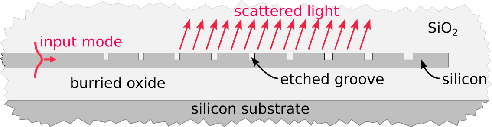
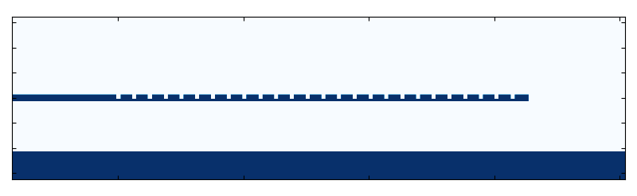
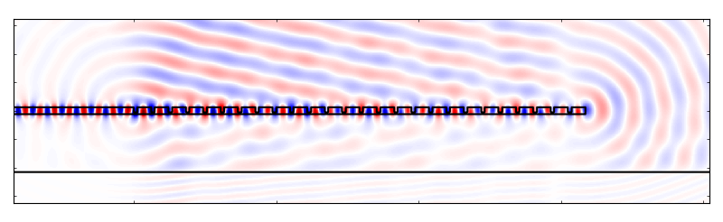
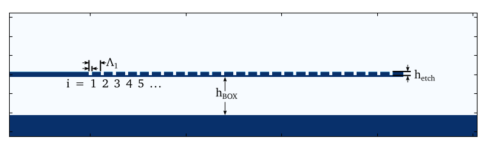
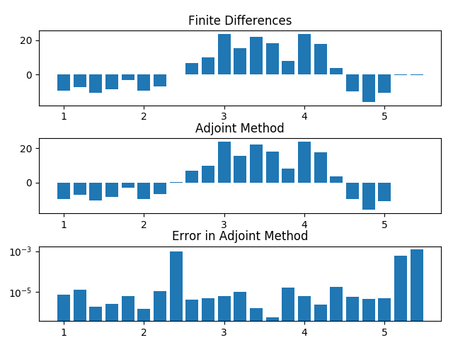
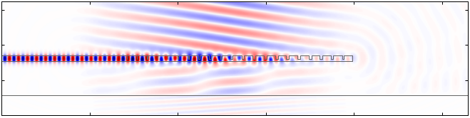
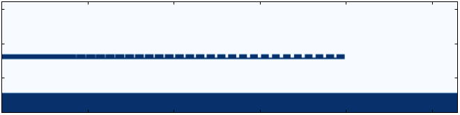
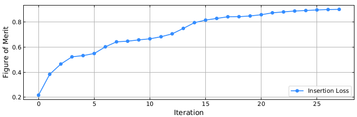

.. _tutorial_grating_coupler:

#############################
Optimizing a Grating Coupler
#############################

In previous tutorials, we learned how to setup and run simulations. These
simulations form the backbone of electromagnetic optimizations and typically
account for a large part of setting up and running an optimization.

In this tutorial, we will demonstrate in detail how what we learned in the previous
tutorials can be used to optimize a grating coupler in two dimensions. This
structure consists of a waveguide with (initially periodic) which is situated
above a thicker silicon slab and which is clad in silicon dioxide.

    Diagram of a typical partially etched grating coupler.

The goal of the optimization will be to modify the grating design in order to
maximize the coupling efficiency of the grating into a desired output Gaussian
beam. The parameters of the grating that we will modify are the widths and
local periodicity of the etched grooves, the depth of the etch, and the
thickness of the burried oxide.

In order to optimized electromagnetic devices, EMopt calculates gradients using
the `adjoint method` [1]. These gradients can be used in conjunction with
off-the-shelf minimization algorithms for optimization. Broadly speaking,
the process of optimizing a device like this grating coupler can be broken into
4 parts:

1. Define the structure to be optimized and set up a simulation of that
   strucutre.
2. Define the design parameters and specify how those design parameters modify
   the structure
3. Define a figure of merit which describes the performance of the device and
   its derivative with respect to the electric and magnetic fields.
4. Verify that the gradients of the figure of merit are accurate.
5. Run the optimization using a minimization algorithm of your choice.

In this tutorial, we will work through each of these steps in detail. By the
end, you should have a good understanding of how EMopt can be used to rapidly
optimized electromagnetic structures with many degrees of freedom.

.. note:: Example Code

    The code associated with this tutorial can be found in
    `examples/Silicon_Grating_Coupler/gc_opt.py <https://github.com/anstmichaels/emopt/blob/master/examples/Silicon_Grating_Coupler/gc_opt.py>`_

.. note:: Running the code

    In order to run code written on top of EMopt, you are encouraged to take
    advantage of MPI for parallelism. EMopt is built on top of MPI from the
    ground up in order to accelerate its execution. In order to run this
    example using MPI on, for example, 14 cores, you would run the command:

        $ mpirun -n 14 python gc_opt.py

    Note that the simulations performed as a part of this optimization are
    quite a bit larger than those in the previous tutorials. Running the code
    with more processes and on a fast machine is recommended.

.. warning:: Previous Tutorials

    This tutorial assumes you have completed the previous tutorials on 2D
    simulation with EMopt. It is highly recommended you work through these
    tutorials first.

=========================
Imports and File Stucture
=========================

In this tutorial, we will be relying primarily on EMopt modules and numpy:

.. code-block:: python

    import emopt
    from emopt.misc import NOT_PARALLEL
    from emopt.adjoint_method import AdjointMethodPNF

    # We define the desired Gaussian modes in a separate file
    from mode_data import Ez_Gauss, Hx_Gauss, Hy_Gauss

    import numpy as np
    from math import pi

Notice a few new things here. First, we have imported a class called
:class:`.AdjointMethodPNF`. This is an interface that we will soon override in
order to define import details of the optimization. Second, we import a set of
functions :func:`Ez_Gauss`, etc. These functions can be found in the example
folder and simply generate a Gaussian field profile that we will use in our
figure of merit calculation (more on this soon).

Beyond this single external set of functions, the entire optimization will be
setup and run from a single python script (:file:`gc_opt.py`). The structure of
this files is as follows:

.. code-block:: python

    class SiliconGratingAM(AdjointMethodPNF):
        ## Define the details of the adjoint method for our grating coupler
        def __init__(self, ...):
            ## Initialize variables
            # [PART 5]

            ## Setup FOM fields
            # [PART 8]

        def update_system(self, params):
            ## given design parameter values, update the system
            # [PART 6]
            pass

        def calc_f(self, sim, params):
            ## calculate the value of the figure of merit
            # [PART 9]
            pass

        def calc_dfdx(self, sim, params):
            ## calculate the derivatives of the figure of merit with respect to
            ## the electric and magnetic fields (df/dEz, df/dHx, and df/dHy)
            # [PART 10]
            pass

        def calc_grad_y(self, sim, params):
            ## calculate the derivative of the figure of merit with respect to
            ## the design parameters
            # We won't use this in this tutorial
            pass

        def get_update_boxes(self, sim, params):
            ## define what regions of the simulation domain are affected by
            ## changes to the design variables
            # [PART 7]
            pass

    def plot_update(params, fom_list, sim, am):
        ## Plot the structure, fields, and figure of merit after each iteration
        # [PART 13]
        pass

    if __name__ == "__main__":
        ## Setup the simulation domain
        # [PART 1]

        ## Setup the geometry
        # [PART 2]

        ## Setup the sources
        # [PART 3]

        ## Setup saved fields
        # [PART 4]

        ## Instantiate the AdjointMethod and verify gradient accuracy
        # [PART 11]

        ## Run the optimization
        # [PART 12]

This file structure is fairly standard for optimizations based on EMopt. In the
next sections of this tutorial, we will fill in each part of this file
(denoted by [PART #]) and discuss some of the finer details.

=========================
Setting up the Simulation
=========================

------------------------------
Creating the Simulation Domain
------------------------------

Our first step is to setup the simulation domain and define the grating coupler
structure. For 1550 nm light, grating couplers are typically ~20 μm long. In
order to full encompass this length and allow the grating to grow a bit, we
will make the simulation domain 26 μm long. Similarly, in order to allow enough
room for the burried oxide which is typically ~2 μm thick and also allow the
beam to propagate a few micron, we will make the simulation domain 8 um tall.
In order to ensure that the simulation is reasonably accurate, we choose a grid
spacing of 20 nm along x and y. Putting all this together, we can instantiate
our simulation object by writing the following code in PART 1 of our
optimization script:

.. code-block:: python

    wavelength = 1.55
    W = 28.0
    H = 8.0
    dx = 0.02
    dy = dx

    # create the simulation object.
    # TE => Ez, Hx, Hy
    sim = emopt.fdfd.FDFD_TE(W, H, dx, dy, wavelength)

    # Get the actual width and height
    W = sim.W
    H = sim.H
    M = sim.M
    N = sim.N
    w_pml = sim.w_pml[0] # PML width which is the same on all boundaries by default

In the last line, we retrieve the size of the perfectly matched layers which by
default is the same on all boundaries. This PML width will come in handy in a
bit when we define the source and figure of merit plane.

---------------------------------
Defining the Simulation Structure
---------------------------------

With the simulation domain setup, we can now begin to specify the geometry of
the system. Our first step is to specify the material values for the system:

.. code-block:: python

    n_si = emopt.misc.n_silicon(wavelength)
    eps_core = n_si**2
    eps_clad = 1.444**2

    # the effective indices are precomputed for simplicity.  We can compute
    # these values using emopt.modes
    neff = 2.86
    neff_etched = 2.10
    n0 = np.sqrt(eps_clad)

Here, we make use of the :func:`.n_silicon` function to get the
value of the refractive index of silicon at 1550 nm. Furthermore, we hardcode
two addition refractive indices (:code:`neff` and :code:`neff_etched`) which
are precomputed values for the effective index of the unetched and etched
sections of the grating coupler. For the purpose of this tutorial, we
precompute these values. In many cases, it may be more desirable to directly
calculate them using :mod:`.modes`.

Our next step is to define the grating coupler structure. As depicted above,
the grating coupler consists of a waveguide with etched grooves. To define this
structure, we will create a rectangle of silicon which defines the input
waveguide and unetched portion of the grating and then a list of smaller
rectangles of silicon dioxide which define the etched slots of the grating. The
initial periodicity of these slots will be calculated uing the effective
indices and desired angle (which in this case is 8 degrees in oxide). Our first
step is to define the waveguide parameters and calculate the grating period in
PART 2 of our script:

.. code-block:: python

    # set up the initial dimensions of the waveguide structure that we are exciting
    h_wg = 0.28
    h_etch = 0.19 # etch depth
    w_wg_input = 5.0
    Ng = 26 #number of grating teeth

    # set the center position of the top silicon and the etches
    y_ts = H/2.0
    y_etch = y_ts + h_wg/2.0 - h_etch/2.0

    # define the starting parameters of the partially-etched grating
    # notably the period and shift between top and bottom layers
    df = 0.8
    theta = 8.0/180.0*pi
    period = wavelength / (df * neff + (1-df)*neff_etched - n0*np.sin(theta))

Next, we build up the grating slots. There will be a total of :code:`Ng`
grating slots, each of with is a rectangle with the desired initial width
(corresponding to a duty factor of 80%) and permittivity:

.. code-block:: python

    # We now build up the grating using a bunch of rectangles
    grating_etch = []

    for i in range(Ng):
        rect_etch = emopt.grid.Rectangle(w_wg_input+i*period, y_etch,
                                         (1-df)*period, h_etch)
        rect_etch.layer = 1
        rect_etch.material_value = eps_clad
        grating_etch.append(rect_etch)

In general, when optimizing grating couplers an initial duty factor >~60%
should be used to ensure that unwanted local minima are avoided. Notice that
the layer of the grating slots is set to 1. This will be the lowest layer value
in our stack to ensure that the grating slot rectangles are on top of the
waveguide.

With the grating slots defined, we can finish off the grating by creating the
background waveguide that is etched:

.. code-block:: python

    # grating waveguide
    Lwg = Ng*period + w_wg_input
    wg = emopt.grid.Rectangle(Lwg/2.0, y_ts, Lwg, h_wg)
    wg.layer = 2
    wg.material_value = eps_core

In terms of the structure, all that remains is the substrate and cladding. Both
are defined using rectangles of the appropriate size and position. In this
optimization, we will begin with a burried oxide thickness (distance between
the bottom of the grating and silicon substrate) of 2 μm. The top and bottom
cladding, meanwhile, will be oxide:

.. code-block:: python

    # define substrate
    h_BOX = 2.0
    h_subs = H/2.0 - h_wg/2.0 - h_BOX
    substrate = emopt.grid.Rectangle(W/2.0, h_subs/2.0, W, h_subs)
    substrate.layer = 2
    substrate.material_value = eps_si # silicon

    # set the background material using a rectangle equal in size to the system
    background = emopt.grid.Rectangle(W/2,H/2,W,H)
    background.layer = 3
    background.material_value = eps_clad

With the different components of the structure defined, all that remains is to
combine them together into a permittivity distribution. We do this using a
:class:`.StructuredMaterial2D`:

.. code-block:: python

    eps = emopt.grid.StructuredMaterial2D(W,H,dx,dy)

    for g in grating_etch:
        eps.add_primitive(g)

    eps.add_primitive(wg)
    eps.add_primitive(substrate)
    eps.add_primitive(background)

Getting the values of this :class:`.StructuredMaterial2D` yields the following
permittivity distribution:

    Initial permittivity distribution of the grating coupler.

You may notice that we chose the simulation width such that there is a decent
amount of space after the end of the grating. This ensures that there is enough
space for grating to grow during the optimization.

In addition to the permittivity distribution, we need to define a permeability
distribution. In this example, the permeability is uniformly equal to one:

.. code-block:: python

    mu = emopt.grid.ConstantMaterial2D(1.0)

With both permittivity and permeability defined, we complete the generation of
the structure by passing :code:`eps` and :code:`mu` to the simulation object.

.. code-block:: python

    sim.set_materials(eps, mu)

This completes PART 2 of our script.

------------------------------
Setting the Simulation Sources
------------------------------

Our next step is to specify the simulation sources. When simulating single
polarization grating couplers using a 2D approximation, we typically have two
options as to how we inject power into the structure. We can either inject the
fundamental TE mode of the input waveguide and measure the field scattered into
free-space modes or we can inject the desired field (a Gaussian beam) and
measure the field coupled into the grating coupler waveguide.

In this optimization, we will be using the former method (injecting power into
the grating coupler waveguide). In order to do this, we will solve for the
modes of the input waveguide to the grating coupler and then extract the
corresponding current density distributions which will surve as the source to
our simulations.

The process for doing this is the same in the previous tutorial. First, we
create a :class:`.DomainCoordinates` which defines the vertical slice of the
simulation where light will be injected in PART 3 of our script:

.. code-block:: python

    w_src= 3.5

    # place the source in the simulation domain
    src_line = emopt.misc.DomainCoordinates(w_pml+2*dx, w_pml+2*dx, H/2-w_src/2,
                                            H/2+w_src/2, 0, 0, dx, dy, 1.0)

Next, We setup the mode solver object by passing the permittivity,
permeability, and source line objects. Note that we are simulating TE fields so
we need to use a TE source:

.. code-block:: python

    # Setup the mode solver.    
    mode = emopt.modes.ModeTE(wavelength, eps, mu, src_line, n0=n_si, neigs=4)

In addition, we also specify a guess for the effective index of the mode we are
looking for. Typically, you should set this to be equal to or greater than the
desired effective index. Since we don't typically know this value before
running the mode solver, using the refractive index of the highest index
material is a safe choice.

Finally, in order to use the mode solver, we build and solve for the mode and
then pass it to our simulation object to set the sources:

.. code-block:: python

    mode.build()
    mode.solve()

    # at this point we have found the modes but we dont know which mode is the
    # one we fundamental mode.  We have a way to determine this, however
    mindex = mode.find_mode_index(0)

    # set the current sources using the mode solver object
    sim.set_sources(mode, src_line, mindex)

Here, :meth:`modes.ModeTE.build` generates the generalized eigenvalue problem which is
solved and then :meth:`modes.ModeTE.solve` actually solves for the modes and effective
indices (eigenfunctions and eigenvalues). The mode solver solves for multiple
modes and stores them internally in an array. In order to get the fundamental
mode, we use the :meth:`mode.ModeTE.find_mode_index` function to figure out which index of
that array contains the fundamental mode (i.e. mode 0).

------------------------------------------------
Specifying Fields to Save (i.e., Field Monitors)
------------------------------------------------

The last step in setting up the underlying simulation for our optimization is
to define where in the simulation domain we want to record the fields. To do
this, we simply define :class:`.DomainCoordinates` objects and pass them to the
simulation object. In this optimization, we want to record the fields in a 1D
slice which will be used to calculate the coupling efficiency of the grating
coupler and a second 2D domain which records the fields in the simulation for
the purpose of visualization. We create these :class:`.DomainCoordinates` objects
in PART 4 of our script:

.. code-block:: python

    mm_line = emopt.misc.DomainCoordinates(w_pml, W-w_pml, H/2.0+2.0, H/2.0+2.0, 0, 0,
                                           dx, dy, 1.0)
    full_field = emopt.misc.DomainCoordinates(w_pml, W-w_pml, w_pml, H-w_pml, 0.0, 0.0,
                                              dx, dy, 1.0)

Finally, we assign these :class:`.DomainCoordinates` objects to the
:code:`field_domains` property of our simulation object:

.. code-block:: python

    sim.field_domains = [mm_line, full_field]

Now, whenever we run a simulation of our grating coupler, the FDFD solver will
automatically save the fields in these two domains. These fields can be
accessed using the :code:`saved_fields` property of the simulation object.

.. note::

    Technically, using the :code:`field_domains` and :code:`save_fields`
    properties are unnecessary. Alternatively, we could just use the
    :meth:`fdfd.FDFD_TE.get_field_interp` function whenever we want to work with the
    fields. The disadvantage this function, however, is that it must be called
    on all processors. This is because the fields are distributed across
    multiple MPI processes. When using the :code:`field_domains` property,
    however, the solver will automatically call :meth:`fdfd.FDFD_TE.get_field_interp`
    immediately after the simulation has finished and save those results on the
    rank 0 process. These fields can then be retrieved at any time, even in a
    non-parallelized block of code. This allows us to largely avoid the
    complexity of working with parallelized code.

-------------------------------
Finalizing the Simulation Setup
-------------------------------

At this point, we are finished setting up our grating coupler simulation. We
can now build the system in preparation for running simulations also in PART 4
of our script:

.. code-block:: python

    sim.build()

In principle, we could now run a simulation of the structure using the
:meth:`fdfd.FDFD_TE.solve_forward` function and visualize the results. Doing so yields
the following field:

    Plot of :math:`E_z` of the initial grating coupler structure.

And there you go! We have a simulated grating coupler.

======================================================
Setting up the optimization: Defining an AdjointMethod
======================================================

The simulation that we just set up forms the foundation of our optimization. At
a high level, the optimization is just (intelligently) tweaking the the
structure in order to "improve" the fields that come out of the simulation. In
many cases, setting up the simulation is the most labor intensive part of
putting together an optimization!

In this section, we will walk through how to construct the second major
component of our grating coupler optimization: the gradient calculation. In
order to rapidly optimize electromagnetic structures EMopt uses a
gradient-based approach. In fact, the core purpose of EMopt is to calculate
derivatives of figures of merits for electromagnetic devices.

The basic idea
(discussed in detail in [1] and [2]) is that we specify a function of the
electric fields, magnetic fields, and design parameters :math:`F(\mathbf{E},
\mathbf{H}, \vec{p})` which is a measure of the performance of our device. We
then take the gradient of this function with respect to the design parameters,

.. math::

    \nabla_\vec{p} F = \left[\frac{\partial F}{\partial p_1}, \frac{\partial F}{\partial p_2}, \frac{\partial F}{\partial p_3}, \dots\right]

This gradient effectively tells us which direction in the design space to
search for the optimal device. We can use this gradient in conjunction with
efficient minimization algorithms like BFGS (provided by scipy.optimize) in
order to find the set of design variables :math:`\vec{p}` which yield an
efficient structure.

It turns out that calculating the gradient :math:`\nabla_\vec{p} F` is a bit
tricky. This is largely a result of (1) the fact that simulations of Maxwell's
equations are quite costly and (2) it is difficult to displace boundaries of a
structure in a smooth way, especially when using finite-difference methods for
the underlying simulations. This is where EMopt shines. EMopt provides us with
an implementation of the *adjoint method* which allows us to calculate the
gradient of our figure of merit using only two simulations. Furthermore, EMopt
implements boundary smoothing techniques (discussed in ref [2]) which ensures
that changes to the boundaries of whatever structure we simulate are
differentiable. 

The latter functionality has already been taken care of for us when we chose to
use the :class:`.StructuredMaterial2D` class for defining the permittivity
distribution. This class applies boundary smoothing to the constituent shapes
when generating the material distribution. As for the provess of using EMopt's
adjoint method implementation, we need to do a bit more work. In particular, we
need to define our own AdjointMethod class.

-----------------------------------
Overview of the AdjointMethod Class
-----------------------------------

In order to optimize our electromagnetic device, we need to specify three
important things:

1. **Parameterization**: Define a set of design parameters (numbers) which
       affect the shape of the device in some way.

2. **Figure of Merit**: The function that describes the performance of the
       device that we will minimize by changing the design parameters.

3. **Analytic Derivative of the Figure of Merit**: The derivative of the
       figure of merit with respect to the electric and magnetic fields.
       This is needed by the adjoing method in order to calculate the
       derivative of the FOM with respect to the design parameters.

Once we have taked care of these three things, we can efficiently calculate the
gradients of our figure of merit. In order to do these things, we create a
custom implementation of an :class:`.AdjointMethod` class. EMopt defines a
couple different base classes which take care of most of the heavy lifting; we
just need to override a few key methods.

Let us go ahead and define this new class and its constructor (PART 5 and 8 of our
script):

.. code-block:: python

    class SiliconGratingAM(AdjointMethodPNF):

        def __init__(self, sim, grating_etch, wg, substrate, y_ts, w_in, h_wg, H, Ng,
                     eps_clad, mm_line):
            # Call super class constructor--important!
            super(SiliconGratingAM, self).__init__(sim, step=1e-10)

            # save the variables for later
            self.grating_etch = grating_etch
            self.y_ts = y_ts
            self.w_in = w_in
            self.h_wg = h_wg
            self.H = H
            self.Ng = Ng
            self.wg = wg
            self.substrate = substrate

            self.mm_line = mm_line
            self.current_fom = 0.0

            # desired Gaussian beam properties used in mode match
            theta = 8.0/180.0*pi
            match_w0 = 10.4/2.0
            match_center = 11.0

            # Define the desired field profiles
            # We use a tilted Gaussian beam which approximates a fiber mode
            Ezm, Hxm, Hym = emopt.misc.gaussian_fields(mm_line.x-match_center,
                                                          0.0, 0.0, match_w0,
                                                          theta, sim.wavelength,
                                                          np.sqrt(eps_clad))

Here, we extend a class defined by EMopt called :class:`.AdjointMethodPNF`.
"PNF" stands for "power normalized function" and is used for figures of merit
which consist of functions which are normalized with respect to the source
power of the simulation. In this optimization, our figure of merit will be the
coupling efficiency into a desired output mode; in order to calculate an
efficiency we will need this power normalization. EMopt contains a number of
other adjoint method classes. See the modules documentation for
:mod:`.adjoint_method` for details.

The constructor we have just defined serves two primary functions: (1) it
stores important variables relating to the grating coupler structure that we
will need when defining the parameterization, figure of merit, etc and (2) it
generates the reference electric and magnetic fields that we will use in the
calculation of our figure of merit.

Next, we will learn how to define the parameterization, figure of merit, and
analytic derivatives needed to complete our :class:`.AdjointMethodPNF`
implementation. We do this by overriding a couple of functions.

-----------------------------
Defining the Parameterization
-----------------------------

The goal of our grating coupler optimization is to apodize the grating and
choose the optimal etch depth and BOX thickness. As such, the design parameters
of our system will be related to the widths and periodicity of the etched
slots, the etch depth, the BOX thickness, and a horizontal shift of the
whole grating:

    Diagram of grating parameterization.

Specifically, for our parameterization we will assign an integer index to each
tooth in the grating. The local "period" and gap width along the grating
will be defined as a Fourier series function of this index:

.. math::

    \Lambda(i) = \sum\limits_{i=1}^{N_F} \left[a_i \sin(\frac{\pi}{N_g}i) + b_i \sin(\frac{\pi}{N_g}i)\right]

.. math::
    w_\mathrm{g}(i) = \sum\limits_{i=1}^{N_F} \left[c_i \sin(\frac{\pi}{N_g}i) + d_i \sin(\frac{\pi}{N_g}i)\right]

Here, :math:`i` is the grating index and :math:`N_g` is the total number of
periods in the grating. The Fouriet coefficients :math:`a_i`, :math:`b_i`,
:math:`c_i`, and :math:`d_i` are design parameters of our optimization. By
manipulating them, we will modify how the etched slots evolve along the length
of the grating.

You may wonder why we don't simply set the individual slot widths and spacings
as the design parameters. In some cases we will do this (for example when we
want to specify feature size constraints, this is an appropriate
parameterization). In this case, however, we choose a Fourier parameterization
with a limited number of terms as it forces the grating to take on a gradually
changing shape. This gradual change is important since (as we will discuss in
just a moment) we are trying to match to a smoothly varying Gaussian beam.
Abrupt changes to the grating structure will not lead to a field that matches
well to a Gaussian beam, and so we choose a parameterization which prevents
that from happening. This has the added benefit that it typically leads to
optimization problems with fewer parameters which exhibit faster convergence
(fewer interations).

In order to actually define the parameterization in code, we need to implement
the :meth:`adjoint_method.AdjointMethod.update_system` function. This function takes a
single 1D array containing the current values of the design parameters as an
argument and updates the simulation structure accordingly. We begin by
extracting the different types of design parameters from the input array (in
PART 6 of our script):

.. code-block:: python

    def update_system(self, params):
        coeffs = params
        Nc = self.Nc

        h_etch = params[-3]
        h_BOX = params[-1]
        x0 = self.w_in + params[-2]

Next we need to update the etched slots. We do this in two steps: first, we
define a little function that computes the desired Fourier series. Next, we
loop through the grating etch rectangles and resize and reposition them based
on this Fourier series:

.. code-block:: python

        fseries = lambda i, coeffs : \
                  coeffs[0] + np.sum([coeffs[j] *np.sin(pi/2*i*j*1.0/self.Ng) \
                                      for j in range(1,Nc)]) \
                            + np.sum([coeffs[Nc + j] * np.cos(pi/2*i*j*1.0/self.Ng) \
                                      for j in range(0,Nc)])
        for i in range(self.Ng):
            w_etch = fseries(i, coeffs[0:2*Nc])
            period = fseries(i, coeffs[2*Nc:4*Nc])

            # update the rectangles
            self.grating_etch[i].width  = w_etch
            self.grating_etch[i].height = h_etch
            self.grating_etch[i].x0     = x0 + w_etch/2.0
            self.grating_etch[i].y0     = self.y_ts + self.h_wg/2.0 - h_etch/2.0

            x0 += period

Finally, we need to update the BOX thickness as well as the length of the
waveguide which is etched to form the grating:

.. code-block:: python

        # update the BOX/Substrate
        h_subs = self.H/2.0 - self.h_wg/2.0 - h_BOX
        self.substrate.height = h_subs
        self.substrate.y0 = h_subs/2.0

        # update the width of the unetched grating
        w_in = x0
        self.wg.width = w_in
        self.wg.x0 = w_in/2.0

This takes care of the :func:`update_system` function. This is one of the most
important functions we implement when setting up a simulation. It forms the
connection between the design parameters and the actual simulated structure. It

.. note::

    The :func:`update_system` function is called very frequently during the
    course of an optimization. As such, you should implement the
    :func:`update_system` function in a reasonably efficient way to minimize
    runtime. Typically this won't actually require any additional consideration
    on your part.

In addition to :func:`update_system`, there is one additional function that we
will implement related to the parameterization: the :func:`get_update_boxes`
function. This function defines a box which defines what region in the
simulation domain is modified by the design parameters. This function exists to
speed up the gradient calculation. In order to handle completely arbitrary
device parameterizations with minimal effort on the user's part, EMopt
calculates shape gradients using finite differences. This involves calculating
material distributions, perturbing the design variables, and recalculating the
material distributions. In order to speed up this calculation, we can restrict
the recalculations to only the relevant part of the simulation domain.

In this case, changes to the Fourier coefficients, the etch depth, and grating
shift will only affect the permittivity in the grating coupler itself. As
such, for these design parameters we specify a box which encompasses the
grating. For the BOX thickness, we use a box which encompasses the whol
simulation for simplicity.

In terms of implementation, :func:`get_update_boxes` expects us to return a
list of lists/tuples which contain 4 floating point values. These 4-float lists
define the bounding boxes. In total, there need to be as many bounding boxes as
there are design parameters. The positions of the bounding boxes in this list
should match the positions of the design parameters in the :code:`params` list.

For our optimization, we do this in PART 7 of our script:

.. code-block:: python

    def get_update_boxes(self, sim, params):
        N = sim.M
        N = sim.N
        h_wg = int(self.h_wg/sim.dy)
        y_wg = int(self.y_ts/sim.dy)
        lenp = len(params)

        # define boxes surrounding grating
        boxes = [(0,N,y_wg-h_wg, y_wg+h_wg) for i in range(lenp-1)]

        # for BOX, update everything (easier)
        boxes.append((0,N,0,M))
        return boxes

This completes our parameterization-related tasks.

----------------------------
Defining the Figure of Merit
----------------------------

Our next step is to define the figure of merit. The purpose of our grating
coupler is to couple 1550 nm light into a single mode optical fiber (SMF-28). A
good approximation for the mode of an SMF-28 fiber is a Gaussian beam with a
full width at half maximum (FWHM) of 10.4 μm. In order to maximize the coupling
of light scattered by our grating coupler into this mode, our figure of merit
will be the mode match between the generated fields and this Gaussian beam.
Assuming no fields are reflected back towards the grating, the mode match
equation is given by

.. math::

    \eta(\mathbf{E}, \mathbf{H}) = \frac{1}{4}\frac{\left|\int dx
    \mathbf{E}\times\mathbf{H}_m\right|^2}{P_\mathrm{src} P_m}

where :math:`\mathbf{E}` is the simulated electric field, :math:`\mathbf{H}_m`
is the reference (desired) magnetic field, :math:`P_\mathrm{src}` is the total
source power (power in the injected waveguide mode), and :math:`P_m` is the
power residing in the reference fields. When the reference fields consist of a
single wavevector (i.e. they are a single mode of the system), this function
yields the fraction of power in the simulated fields which is contained in the
desired field. When the reference field is not described by a single
wavevector, this function is a slightly more approximate description of
coupling efficiency. For our approximate fiber mode, this function will do a
good job of representing the coupling efficiency.

We can implement this figure of merit in our code in two steps. The first step,
which we have actually already completed, is to define the reference fields.
This is accomplished at the end of our AdjointMethod constructor (PART 8) with the
following code:

.. code-block:: python

        Ezm, Hxm, Hym = emopt.misc.gaussian_fields(mm_line.x-match_center,
                                                      0.0, 0.0, match_w0,
                                                      theta, sim.wavelength,
                                                      np.sqrt(eps_clad))
        self.mode_match = emopt.fomutils.ModeMatch([0,1,0], sim.dx, Ezm=Ezm, Hxm=Hxm, Hym=Hym)

Here we generate the refernce fields with the help of the
:meth:`misc.gaussian_fields` function. These fields are then used to
instantiate a :class:`.ModeMatch` object as shown above. The
:class:`.ModeMatch` class is one of the most essential classes when it comes to
defining figures of merit in silicon photonics. It facilitates not only the
calculation of mode matches, but also the calculation of its derivative with
respect to the electric and magnetic fields.

In order to actually set the figure of merit for our :class:`.AdjointMethodPNF`,
we simply override the function :func:`calc_f`. This function has two
arguments, the simulation object and the current array of design parameters,
and returns the current value of the figure of merit *without any power
normalization*. In other words, if the figure of merit is given by

.. math::

    F(\mathbf{E}, \mathbf{H}) = \frac{f(\mathbf{E}, \mathbf{H})}{P_\mathrm{src}}

then this function calculates :math:`f(\mathbf{E}, \mathbf{H})`. Whenever we
wish to calculate the figure of merit in the future, we will use the :meth:`adjoint_method.AdjointMethod.fom`
function which internally calls our :func:`calc_f` function and normalizes it
with respect to the source power.

In this case, we want to return the (non-normalized) mode match between the
simulated fields and the desired Gaussian fields. The :func:`calc_f` function
(PART 9) which accomplish this is relatively simple:

.. code-block:: python

    def calc_f(self, sim, params):
        # Get the fields which were recorded 
        Ez, Hx, Hy = sim.saved_fields[0]

        # compute the mode match efficiency
        self.mode_match.compute(Ez=Ez, Hx=Hx, Hy=Hy)

        # we want to maximize the efficiency, so we minimize the negative of the efficiency
        self.current_fom = -self.mode_match.get_mode_match_forward(1.0)
        return self.current_fom

Here, the :class:`.ModeMatch` class is doing the bulk of the heavy lifting. You
will notice that we made the mode match negative. The reason for this is that
the optimizer will try to *minimize* our figure of merit. In order to maximize
the mode match, we minimize the negative of the mode match.

This finished the process of defining our figure of merit. To recap: in order
to define the figure of merit, we override the appropriate function of the
:class:`.AdjointMethod` class. In this case, since our adjoint method
implementation is based on the :class:`.AdjointMethodPNF` class, we implement
the :func:`calc_f` function which simply retrieves the simulated fields and
uses them to calculate the figure of merit (without power normalization).

-------------------------------------------------
Calculation the Derivative of the Figure of Merit
-------------------------------------------------

In order to complete our adjoint method implementation, we must supply the
derivative of our figure of merit with respect to the electric and magnetic
fields. Because we are working with TE fields, this means that we need to
calculate the gradients :math:`\partial F/\partial \vec{E}_z`,
:math:`\partial F/\partial \vec{H}_x`, and :math:`\partial F/\partial \vec{E}_y`.

Because we are using the :class:`.ModeMatch` class, this process is relatively
straightforward. All we need to do is to override the :func:`calc_dfdx`
function and generate 2D arrays which span the whole simulation domain. These
arrays will contain the analytically calculated derivatives of the figure of
merit with respect to E and H. We accomplish this in PART 10 with:

.. code-block:: python

    def calc_dfdx(self, sim, params):
        dFdEz = np.zeros([sim.M, sim.N], dtype=np.complex128)
        dFdHx = np.zeros([sim.M, sim.N], dtype=np.complex128)
        dFdHy = np.zeros([sim.M, sim.N], dtype=np.complex128)

        # Get the fields which were recorded 
        Ez, Hx, Hy = sim.saved_fields[0]

        self.mode_match.compute(Ez=Ez, Hx=Hx, Hy=Hy)

        dFdEz[self.mm_line.j, self.mm_line.k] = -self.mode_match.get_dFdEz()
        dFdHx[self.mm_line.j, self.mm_line.k] = -self.mode_match.get_dFdHx()
        dFdHy[self.mm_line.j, self.mm_line.k] = -self.mode_match.get_dFdHy()

        return (dFdEz, dFdHx, dFdHy)

.. note::

    Why are the derivatives 2D arrays which span the whole simulation? 
    
    These derivatives are taken with respect to the field values. Since we are
    working in a discretized space, this is equivalent to taking the derivative
    with respect to the field at each point in the grid.

    How are these derivatives used?

    The basic idea behind the adjoint method is that we run two simulations of
    the structure, and based on these two simulations we can calculate the full
    gradient of our figure of merit with respect to all of the design
    variables. One of these simulations, which we call the forward simulation,
    is simply a simulation of Maxwell's equations. The second simulation, which
    we call the adjoint simulation, is a simulation of the transpose of
    Maxwell's equations. It turns out (as a result of some basic math) that the
    current sources for this adjoint equation are exactly equal to the
    derivative of our figure of merit with respect to the field at each point
    in the grid.

In cases where you implement a different figure of merit, you will need to
manually calculate the derivatives of your figure of merit with respect to the
fields at each point in the grid. For example, let us consider the case where
our figure of merit is given by:

.. math::

    F(\mathbf{E}) = \left|E_z\right|^2

In this case, the derivatives of our figure of merit are given by

.. math::

    \frac{\partial F}{\partial E_z}\bigg|_{i j} = \frac{\partial}{\partial E_z}\left(\left|E_z\right|^2\right)\bigg|_{i j}
    = \frac{\partial}{\partial E_z}\left(E_z E_z^*\right)\bigg|_{i j}
    = E_{z,ij}^*

.. math::

    \frac{\partial F}{\partial H_x}\bigg|_{i j} = 0

.. math::

    \frac{\partial F}{\partial H_y}\bigg|_{i j} = 0

The :func:`calc_dfdx` function that we would write which corresponds to this
figure merit would be:

.. code-block:: python

    def calc_dfdx(self, sim, params):
        dFdEz = np.zeros([sim.M, sim.N], dtype=np.complex128)
        dFdHx = np.zeros([sim.M, sim.N], dtype=np.complex128)
        dFdHy = np.zeros([sim.M, sim.N], dtype=np.complex128)

        # Get the fields which were recorded 
        Ez, Hx, Hy = sim.saved_fields[0]

        dFdEz[self.mm_area.j, self.mm_area.k] = np.conj(Ez)
        dFdHx[self.mm_area.j, self.mm_area.k] = 0.0
        dFdHy[self.mm_area.j, self.mm_area.k] = 0.0

        return (dFdEz, dFdHx, dFdHy)

As you can see, the general structure of this function is identical. The only
thing that changes is exactly what we assign to these arrays.

.. note:: (Advanced)

    When calculating these derivatives, we work with the interpolated fields
    and take derivatives with respect to these interpolated fields (which
    directly reflects what we would write down with pen and paper). In reality,
    we need to supply the derivatives with respect to the *uninterpolated*
    fields. The :class:`.AdjointMethodPNF` actually takes care of this for us
    internally. If, however, we ever decide to use the :class:`.AdjointMethod`
    class instead, we need to manually account for the fact that the
    interpolated fields are actually a sum of uninterpolated fields. The
    easiest and *safest* way to do this is to simply differentiate the fields
    as if the fields are not interpolated (i.e. do it naively) and then use the
    :meth:`fomutils.interpolated_dFdx_2D` function which modifies the
    derivatives to account for interpolation. In 3D, the same can be
    accomplished using the :meth:`fomutils.interpolated_dFdx_3D`
    function.

At this point we have completed our adjoint method class and we can move on to
checking that it works correctly!

============================
Verifying Accurate Gradients
============================

Once we have completed our adjoint method class, it is *essential* that we
verify that the gradient calculation is accurate. This is accomplished using
the :meth:`adjoint_method.AdjointMethod.check_gradient` function. Returning to our :code:`if
__name__ == '__main__'` block, we write in PART 11:

.. code-block:: python

    N_coeffs = 5
    design_params = np.zeros(N_coeffs*4+3)
    design_params[0*N_coeffs] = (1-df) * period
    design_params[2*N_coeffs] = period
    design_params[-3] = h_etch
    design_params[-2] = 0.0
    design_params[-1] = h_BOX

    # We initialize our application-specific adjoint method object which is
    # responsible for computing the figure of merit and its gradient with
    # respect to the design parameters of the problem
    am = SiliconGratingAM(sim, grating_etch, wg, substrate, y_ts,
                            w_wg_input, h_wg, H, Ng, N_coeffs, eps_clad, mm_line)

    am.check_gradient(design_params)

Here we instantiate our custom :class:`.AdjointMethodPNF` class, define an
initial set of design parameters, and then run the :func:`check_gradient`
function. Our initial set of design parameters just sets the period, 
slot width, BOX thickness, and etch depth to some reasonable values.

If everyhthing is setup correctly, this should eventually produce the following
output::

    [INFO] The total error in the gradient is 6.6894E-06

This means that the total estimated error in the gradient is less than
:math:`10^{-5}` which tells us that the gradient is being computed correctly.
Furthermore, a plot similar to the following should be generated:

    Verification of gradient accuracy.

This shows the individual derivatives computed using finite differences and the
adjoint method and computes the relative error in each derivative (with respect
to the finite difference).

Whenever we setup an optimization it is essential that we verify that the
gradients are accurate as we have done here. If the gradients are not accurate
(error :math:`> \sim 10^{-2}`), then we are significantly more likely to run
into issues during the optimization. Once we have verified their accuracy, we
can continue on to running the optimization with high confidence that the
optimization will "work."

.. note::

    What do we mean by gradient accuracy in this case? In EMopt, the gradient
    calculated using the adjoint method is compared to a gradient calculated
    using brute force finite differences. Given these two gradients
    :math:`\nabla_\mathrm{FD} F` and :math:`\nabla_\mathrm{AM} F`, the error is
    defined as 
    
    error = :math:`\frac{\bigg|\nabla_\mathrm{FD} F \cdot \nabla_\mathrm{AM} F\bigg|}{\bigg|\nabla_\mathrm{FD} F\bigg|}`

========================
Running the Optimization
========================

In the previous sections, we have setup the grating coupler simulation, defined
a parameterization, defined a figure of merit, and verified that our gradients
are being computed correctly. The only thing left to do is to setup and run the
optimization!

Setting up an optimization is straightforward with the help of the
:class:`.Optimizer` class. This class provides an interface to
the :func:`scipy.optimize.minimize` function. The process for setting up the
optimizer is as follows. In PART 12 we write:

.. code-block:: python

    fom_list = []
    callback = lambda x : plot_update(x, fom_list, sim, am)

    # setup and run the optimization!
    opt = emopt.optimizer.Optimizer(am, design_params, tol=1e-5,
                                    callback_func=callback,
                                    opt_method='BFGS',
                                    Nmax=40)

    # Run the optimization
    final_fom, final_params = opt.run()

This sets up an :class:`.Optimizer` object which takes our
:class:`.AdjointMethodPNF` object, and initial guess for our design parameters,
and a number of other optional arguments. Calling :code:`opt.run()` runs the
optimization using the BFGS algorithm as we specified using the
:code:`opt_method` argument.

You will notice that another one of the optional arguments that we passed in was the
:code:`callback_func` parameter. This allows us to pass a function to the
optimizer which it will then call at the end of each iteration of the
optimization. In this case, we define a callback function called 
:func:`plot_update` (PART 13):

.. code-block:: python

    def plot_update(params, fom_list, sim, am):
        print('Finished iteration %d' % (len(fom_list)+1))
        current_fom = -1*am.calc_fom(sim, params)
        fom_list.append(current_fom)

        Ez, Hx, Hy = sim.saved_fields[1]
        eps = sim.eps.get_values_in(sim.field_domains[1])

        foms = {'Insertion Loss' : fom_list}
        emopt.io.plot_iteration(np.flipud(Ez.real), np.flipud(eps.real), sim.Wreal,
                                sim.Hreal, foms, fname='current_result.pdf',
                                dark=False)

        data = {}
        data['Ez'] = Ez
        data['Hx'] = Hx
        data['Hy'] = Hy
        data['eps'] = eps
        data['params'] = params
        data['foms'] = fom_list

        i = len(fom_list)
        fname = 'data/gc_opt_results'
        emopt.io.save_results(fname, data)

This function prints out the current iteration number, generates a plot of the
current state of the optimization (figure of merit, fields, and structure) and
then saves the current state of the optimization to a file. In order to save a
plot of the state of the optimization, the :meth:`io.plot_iteration`
function is a convenient option. Alternatively, you may generate your own plot
using, for example, matplotlib. In order to save the data file, we use the
:meth:`io.save_results` function. This function takes a file name
(without extension) and two dictionaries containing any data you would like
saved. The first (required) dict may only contain particular "identifiable"
data like the field arrays, permittivity array, figure of merit, etc. An
additional dict with arbitrary contents can be supplied and saved as well (using
the optional :code:`additional` argument). This function saves the contents to
the widely recognized hdf5 format.

It is important to note that the :func:`plot_update` function takes multiple
arguments however the :class:`.Optimizer` class expects a function with only one
argument (the design parameter array). In order to get around this, you will
note that we defined a lambda function that effectively hides away the
additional arguments. This is the easy and effective solution.

If everything is setup correctly, the optimization should complete after 27
iterations. This process takes around 37 minutes on an Intel Xeon E5-2697 v3.
The final fields, structure, figure of merit history should look something like
this:

    Simulated fields of the optimized grating coupler.

    Permittivity distribution of the optimized grating coupler.

    Progress of the figure of merit during the optimization.

Congratulations! You have optimized a grating coupler! This optimized grating
achieves a very high coupling efficiency of 90% (-0.45 dB) and gives you a
sense of what we can achieve using EMopt!

=========================================================
Taking Things to the Next Level: Constrained Optimization
=========================================================

If you look at the final result of our optimization, you will notice that the
optimized structure contains some very small features. In reality, these
features will not be resolved using deep UV lithography. In order to account
for this, we can run a *constrained* optimization.

The basic process for running the constrained optimization is very similar to
the optimization we just put together. There are three main differences:

1. We use the previous result as the starting point instead of a simpler
   physically-intuited structure.
2. We parameterize the grating in terms of the actual slot widths and periods.
3. We impose an additional penalty term to the figure of merit which reduces
   the figure of merit if slots in the grating become too narrow.

To see how all of this is done, check out the 
`gc_opt_constrained.py <https://github.com/anstmichaels/emopt/blob/master/examples/Silicon_Grating_Coupler/gc_opt_constrained.py>`_
example file.

==========
References
==========

[1] Andrew Michaels and Eli Yablonovitch, "Inverse design of near unity efficiency perfectly vertical grating couplers," Opt. Express 26, 4766-4779 (2018)

[2] Andrew Michaels and Eli Yablonovitch, "Leveraging continuous material averaging for inverse electromagnetic design," Opt. Express 26, 31717-31737 (2018)
