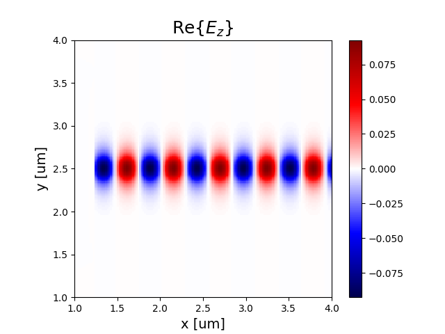

.. _tutorial_2D_waveguide_mode_sim:

################################################################
Simulating a Waveguide in 2D Which is Excited With a Mode Source
################################################################

In this tutorial, we will combined what we learned in the previous two
tutorials in order to simulate a waveguide which is excited by a mode source. A
mode source is a special type of current source distribution which
unidirectionally injects the desired guided mode.

.. note:: Example Code

    The code associated with this tutorial can be found in
    `examples/simple_waveguide/simple_waveguide_mode.py <https://github.com/anstmichaels/emopt/blob/master/examples/simple_waveguide/simple_waveguide_mode.py>`_

.. note:: Running the code

    In order to run code written on top of EMopt, you are encouraged to take
    advantage of MPI for parallelism. EMopt is built on top of MPI from the
    ground up in order to accelerate its execution. In order to run this
    example using MPI on, for example, 4 cores, you would run the command:

        $ mpirun -n 4 python simple_waveguide_mode.py

================================
Setting up the Simulation Domain
================================

As with the previous tutorials, our first step is to import the necessary
modules that we will use. In this example, those modules are :mod:`emopt` and
:mod:`numpy`:

.. code-block:: python

    import emopt
    from emopt.misc import NOT_PARALLEL

    import numpy as np

The `NOT_PARALLEL` variable that we import allows us to do non-parallel
operations like plotting. We will return to this at the end of the tutorial!

After importing the necessary modules, we define the size and resolution of the
simulation as well as the wavelength of the simulation source:

.. code-block:: python

    W = 5.0
    H = 5.0
    dx = 0.02
    dy = 0.02
    wlen = 1.55

In this tutorial, the simulation domain (including perfectly matched layers)
will be 5 μm by 5 μm and the spatial grid step will be 20 nm. Based on our
chosen wavelength of 1.55 μm, this simulation resolution yields 22 grid cells
per wavelength in the high index material, which should ensure that the
simulation is reasonably accurate.

With the simulation parameters chosen, we can instantiate our simulation
object. In this tutorial, we will be performing a 2D transverse electric
field simulation (i.e. the simulated field components are :math:`E_z`,
:math:`H_x`, :math:`H_y`):

.. code-block:: python

    sim = emopt.fdfd.FDFD_TE(W, H, dx, dy, wlen)

    W = sim.W
    H = sim.H
    M = sim.M
    N = sim.N

Typically, an integer number of grid cells of the chosen dimension will not fit
in the simulation domain. EMopt will "stretch" the simulation domain such that
it does contain an integer number of grid cells. This results in an updated
simulation width and height which we retrieve from the `sim` object. Similarly,
we retrieve the number of grid cells along x (`N`) and along y (`M`) from the
`sim` object.

With the simulation object instantiated, we are ready to start defining
simulation geometry!

=================================
Defining Materials and Structures
=================================

In order to simulate a waveguide, we need to define the waveguide size and
material value. The waveguide in this tutorial is a 220 nm wide silicon
waveguide (index ~3.45). The waveguide is clad on top and bottom by silicon
dioxide (index ~1.44). In order to define this material distribution, we create
a rectangle for the waveguide and a second rectangle which spans the whole
simulation domain. These are combined to form a permittivity distribution:

.. code-block:: python

    # Material constants
    n0 = 1.44
    n1 = 3.45

    # set a background permittivity of 1
    eps_background = emopt.grid.Rectangle(W/2, H/2, 2*W, H)
    eps_background.layer = 2
    eps_background.material_value = n0**2

    # Create a high index waveguide through the center of the simulation
    h_wg = 0.22
    waveguide = emopt.grid.Rectangle(W/2, H/2, W*2, h_wg)
    waveguide.layer = 1
    waveguide.material_value = n1**2

    # Create the a structured material which holds the waveguide and background
    eps = emopt.grid.StructuredMaterial2D(W, H, dx, dy)
    eps.add_primitive(waveguide)
    eps.add_primitive(eps_background)

Similarly, we need to define a permeability distribution. This can be done in
an identical manner. In this tutorial, we want the permeability to be uniformly
1. This is easily accomplished by creating a
:class:`emopt.grid.ConstantMaterial2D` object:

.. code-block:: python

    mu = emopt.grid.ConstantMaterial2D(1.0)

With the permittivity and permeability distribution formed, we can pass them
onto the solver, thus completing the process of defining the simulation
geometry:

.. code-block:: python

    sim.set_materials(eps, mu)

Now we just need to set up the sources which will excite the waveguide we have
just defined!

.. note::

    For more complicated geometries, :class:`emopt.grid.Rectangle` may be
    insufficient. In such cases, the :class:`emopt.grid.Polygon` class provides
    increased flexibility.

===================================
Defining the Simulation Mode Source
===================================

Our goal in this tutorial is to excite the fundamental mode of the waveguide.
In order to do this, we have to first calculate the mode of the waveguide that
we want to excite. We can then use calculate the current density distribution
which will excite that waveguide mode.

In order to calculate the waveguide mode, we take a vertical slice of the
simulation and pass it to EMopt's mode solver:

.. code-block:: python

    src_line = emopt.misc.DomainCoordinates(W/4, W/4, sim.w_pml[2], H-sim.w_pml[3], 
                                            0.0, 0.0, dx, dy, 1.0)

    # setup, build the system, and solve
    mode = emopt.modes.ModeTE(wlen, eps, mu, src_line, n0=n1, neigs=4)
    mode.build()
    mode.solve()

For the purpose of solving for the waveguide mode, the x position of the slice
does not matter. However, we will use the same :class:`DomainCoordinates` to
specify where in the simulation the source plane will be placed, thus in this
case the x position does matter. For this tutorial, the source plane will span
the y dimension of the simulation (excluding the perfectly matched layers which
are automatically defined) and will be positioned at :math:`x=W/4`.

With the waveguide mode calculated, all we need to do is passed the built and
solve mode solver to our simulation object. The simulation object will take
care of generating the necessary current distribution arrays:

.. code-block:: python

    # after solving, we cannot be sure which of the generated modes is the one we
    # want.  We find the desired TE_X mode
    mindex = mode.find_mode_index(0)

    # set the sources using our mode solver
    sim.set_sources(mode, src_line, mindex)

Note that when setting the sources using a mode solver, we must also provide
the :class:`DomainCoordinates` which specifies the location of the mode source
as well as the index of the mode we want to excite. For the fundamental mode,
this index is typically 0, however to be safe, in this tutorial we use the
:func:`mode.finde_mode_index` function to get the :math:`TE_0` mode.

======================
Running the Simulation
======================

With the simulation geometry and sources defined, we are read to run the
simulation and visualize the results. In order to run a simulation, we first
build the problem and then solve for the fields:

.. code-block:: python

    sim.build()
    sim.solve_forward()

Depending on how powerful your computer is and how many processes you run it
with, these two function calls should only take ~10 seconds.

Once the :func:`solve_forward` function is complete, we can retrieve the
simulated fields in a desired area of the simulation domain by specifying the
region using :class:`emopt.misc.DomainCoordinates` and then calling the
:func:`emopt.fdfd.FDFD_TE.get_field_interp` function. In our case, we want to
retrieve the :math:`E_z` component of the field:

.. code-block:: python

    sim_area = emopt.misc.DomainCoordinates(1.0, W-1.0, 1.0, H-1.0, 0.0, 0.0, dx, dy, 1.0)
    Ez = sim.get_field_interp('Ez', sim_area)

The variable `Ez` will be a numpy array with dimensions which match `sim_area`.
With the field retrieved, we are free to do with it as we wish. In this case,
let us visualize them using matplotlib:

.. code-block:: python

    if(NOT_PARALLEL):
        import matplotlib.pyplot as plt

        extent = sim_area.get_bounding_box()[0:4]

        f = plt.figure()
        ax = f.add_subplot(111)
        im = ax.imshow(Ez.real, extent=extent,
                                vmin=-np.max(Ez.real)/1.0,
                                vmax=np.max(Ez.real)/1.0,
                                cmap='seismic')
        f.colorbar(im)
        ax.set_title('E$_z$', fontsize=18)
        ax.set_xlabel('x [um]', fontsize=14)
        ax.set_ylabel('y [um]', fontsize=14)
        plt.show()

When doing plotting like this, it is important to run all of the plotting code
in an :code:`if(NOT_PARALLEL)` block. This is because some simulation results
may only be stored in the rank 0 process and also because we typically don't
want to plot things N times. :code:`NOT_PARALLEL` ensures that the plot is
generated only once.

    Real part of the electric field of a waveguide which is excited by a mode source.
