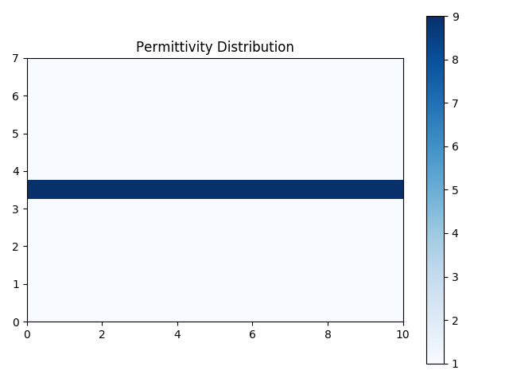
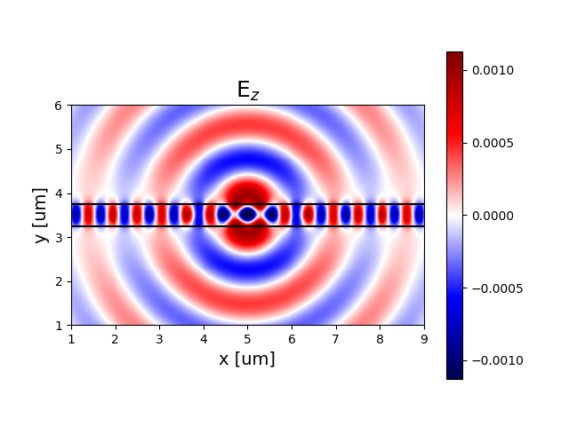

.. _tutorial_2D_waveguide_sim:

############################
Simulating a Waveguide in 2D
############################

Before delving into the details of how to use EMopt to optimize electromagnetic
structures, it is a good idea to first familiarize yourself with how setup and
run simulations using the tools provided (which will ultimately provide the
foundation for optimizations). The following tutorial will demonstrate how to
simulate a simple waveguide structure using EMopt's 2D Maxwell solver.
Furthermore, it will help you familiarize yourself with EMopt's approach to
solving electromagnetic problems.

.. note:: Example Code
    The code associated with this tutorial can be found in
    `examples/simple_waveguide/simple_waveguide.py <https://github.com/anstmichaels/emopt/blob/master/examples/simple_waveguide/simple_waveguide.py>`_

.. note:: Running the code

    In order to run code written on top of EMopt, you are encouraged to take
    advantage of MPI for parallelism. EMopt is built on top of MPI from the
    ground up in order to accelerate its execution. In order to run this
    example using MPI on, for example, 4 cores, you would run the command:

        $ mpirun -n 4 python simple_waveguide.py

================================
Importing the Required Libraries
================================

In order to use EMopt, the first thing we must do is import the EMopt module.
For access to most components of EMopt, we will simply import the top-level
module ``emopt``:

.. code-block:: python

    import emopt

As we fill find out in just a moment, all submodules, classes and functions can
be called using ``emopt.X.Y`` where ``X`` is the submodule and ``Y`` is the class or
function. In this example, we will explicitly import one addition EMopt
variable which will come in handy later on in the tutorial:

.. code-block:: python

    from emopt.misc import NOT_PARALLEL

Finally, almost all mathematical operations will make use of the ``numpy`` library.
As such, we need to import numpy:

.. code-block:: python

    import numpy as np

At this point, we are ready to start using EMopt!

================================
Setting up the Simulation Domain
================================

The first step in setting up a simulation is to define the dimensions of the
simulation domain, the resolution of the simulation grid, and the wavelength
of the source excitation. We do this by defining corresponding variables and
then instantiating an FDFD object, supplying those variables as parameters:

.. code-block:: python

    W = 10.0
    H = 7.0
    dx = 0.02
    dy = 0.02
    wlen = 1.55
    sim = emopt.fdfd.FDFD_TE(W, H, dx, dy, wlen)

In this example, we will make the simulation 10 μm wide by 7 μm tall. Notice
that we wrote this simply as 10.0 and 7.0, respectively and not, for example,
10e-6 and 7e-6 (i.e. in metric). This is
because EMopt solves non-dimensionalized equations. In the case of length
quantities, everything is normalized with respect to the wavelength. This means
that if we want the wavelength to be 1.55 μm and we want to express all other
lengths in units of μm, we simply set ``wavelength = 1.55`` (as we did above).
As long as we are consistent with these units everything works out.

The simulation resolution, meanwhile, is set by defining a spatial
discretization size (or grid cell size) along the `x` and `y`. In this example,
we choose these dimensions, given by ``dx`` and ``dy``, to be 20 nm. Note that
currently, EMopt only supports uniform rectangular grids (which should be
sufficient or even desirable in most cases).

Finally, in the last line above, we instantiate an :class:`FDFD_TE` object.
FDFD stands for **F**\ inite **D**\ ifference **F**\ requency **D**\ omain and refers
to the method we will use to solve Maxwell's Equations in 2D. TE, meanwhile,
refers to "transverse electric" and idicates that we will be solving for the
fields :math:`E_z`, :math:`H_x`, and :math:`H_y`. Depending on the problem we
wish to solve, EMopt also provides the :class:`FDFD_TM` class for 2D TM
simulations.

One thing that is important to be aware of is that you are not required to
select simulation widths which are exactly divisible by the grid spacing. In
the case that `W/dx` and/or `H/dy` are not integers, EMopt will automatically
modify "snap" the simulation dimensions to the nearest grid cell. As such, it
is generally a good idea to update the ``W`` and ``H`` variables after
instantiating the FDFD object. Furthermore, the FDFD object also exposes the
number of grid cells along the `x` and `y` directions. To access these
variables:

.. code-block:: python

        W = sim.W
        H = sim.H
        N = sim.N
        M = sim.M

Here, ``N`` is the number of grid cells along the `x` direction and ``M`` is
the number of grid cells along the y directions (this matches matrix/array
index notation).

====================================
Defining the Structure and Materials
====================================

Our ultimate goal is to simulate a 2D waveguide which is excited by a dipole
source. As such, we need to define the waveguide, which is ultimately just a
particular distribution of permittivity and permeability. EMopt provides a few
ways of defining material distributions, however the most common approach is
through the use of the :class:`StructuredMaterial2D` and
:class:`ConstantMaterial2D` classes.

In order to define a simple waveguide, we will create a rectangle with the
desired position and dimensions. We will then assign this rectangle a
permittivity value and a layer. Lower number layers will appear on top of
layers with higher numbers (in other words, lower number = higher priority).
Just as with the waveguide, we will define a background/cladding material. The
process is as follows:

.. code-block:: python

    # Materials
    n0 = 1.0
    n1 = 3.0

    # set a background permittivity of 1
    eps_background = emopt.grid.Rectangle(W/2, H/2, 2*W, H)
    eps_background.layer = 2
    eps_background.material_value = n0**2

    # Create a high index waveguide through the center of the simulation
    h_wg = 0.5
    waveguide = emopt.grid.Rectangle(W/2, H/2, 2*W, h_wg)
    waveguide.layer = 1
    waveguide.material_value = n1**2

In EMopt, :class:`emopt.grid.Rectangle`\ s belong to a broader class of elements called
:class:`MaterialPrimitive`\ s. A :class:`MaterialPrimitive` is a shape which
can be combined with other shapes in order to form more complex structures. In
order to combine shapes together into complex structures, we use a
:class:`emopt.grid.StructuredMaterial2D` which is a container for
:class:`MaterialPrimitive`\ s that facilitates the generation of material
distributions based on collections of :class:`MaterialPrimitive`\ s.

In order to define the permittivity distribution, all we need to do is create a
:class:`emopt.grid.StructuredMaterial2D` which contains the cladding and waveguide
rectangles:

.. code-block:: python

    eps = emopt.grid.StructuredMaterial2D(W, H, dx, dy)
    eps.add_primitive(waveguide)
    eps.add_primitive(eps_background)

At this point, we have defined a permittivity distribution, which we can
generate using :func:`StructuredMaterial2D.get_values` and which is depicted
below.

    Permittivity distribution for a simple waveguide.

.. note:: Complex Material Values

    EMopt supports both real and complex material values in 2D. To define a
    complex material, we simply write :code:`material_value = a + 1j*b` where
    `a` and `b` are numbers.

The permeability distribution can be defined in an identical manner. At optical
frequencies, in many cases the permeability is assumed to be uniformly equal to
1.0. We make this same assumption in this tutorial. EMopt provides a simple
way to define uniform constant material distributions using the
:class:`emopt.grid.ConstantMaterial2D` class:

.. code:: python

    mu = emopt.grid.ConstantMaterial2D(1.0)

With permittivity and permeability distributions defined, our last step in
defining the simulated structure is to actually set the material distributions
in our simulation (which is encapsulated by the FDFD object we created
earlier). To do this, we simply write:

.. code:: python

    sim.set_materials(eps, mu)

With this, we have finished defining the structure that we will simulate.

====================
Defining the Sources
====================

The final missing ingredient in setting up our simulation is the source.
Sources consist of some arrangement of electric and magnetic dipoles (small
oscillating currents). EMopt provides two ways of defining the current sources
in a 2D simulation. First, you can explicitly define arrays which specify the
distribution of the complex magnitudes of the current density which excites the
system. Alternatively, you can generate current density distributions using
EMopt's mode solver (a topic covered in future tutorials).

In this example, we seek to excite the waveguide with an electric dipole
(pointing in the z direction). We can achieve this by creating arrays and
setting a single value in the desired location to 1.0.  Once we have defined
arrays for the three relevant current densities (:math:`J_z`, :math:`M_x`, and
:math:`M_y`), we can pass them to the FDFD object in order to complete the
process:

.. code-block:: python

    # setup the sources -- just a dipole in the center of the waveguide
    Jz = np.zeros([M,N], dtype=np.complex128)
    Mx = np.zeros([M,N], dtype=np.complex128)
    My = np.zeros([M,N], dtype=np.complex128)
    Jz[M/2, N/2] = 1.0

    sim.set_sources((Jz, Mx, My))

Notice a few import things. First, the size of the arrays must match the size
of the simulation domain. This is straight forward to achieve by using the `N`
and `M` variables obtained previously from the FDFD object. Next, when creating
the numpy arrays which define the current density distributions, we explicitly
assigned their data type to be `np.complex128`. This is required as the arrays
must support complex amplitudes.

In this tutorial, we place the dipole (approximately) at the center of the
simulation by simply selecting the corresponding array element. More
complicated distributions can be constructured using basic numpy operations.

======================
Running the Simulation
======================

Having defined the structure and sources, we are ready to run the simulation!
Running a simulation is performed in two steps. We first _build_ the problem.
This tells the FDFD solver to assemble the system of equations to be solved
(i.e., all of the curls, etc in Maxwell's equations) and update its
internally-stored material distribution. Next, we run the simulation by calling
the corresponding function:

.. code-block:: python

    sim.build()
    sim.solve_forward()

The function :func:`solve_forward` runs the simulation. The details of why it
is called `solve_forward` and not simply `solve` will be discussed in future
tutorials.

===================
Viewing the Results
===================

After the call to solve_forward is complete, our FDFD object will have solved
for the electric and magnetic fields of our structure. To access these fields,
we first define the region in which we want to retrieve the fields and then
retrieve the desired field component in that region:

.. code-block:: python

    # Get the fields we just solved for
    # define a plane using a DomainCoordinates with no z-thickness
    sim_area = emopt.misc.DomainCoordinates(1.0, W-1.0, 1.0, H-1.0, 0, 0, dx, dy, 1.0)
    Ez = sim.get_field_interp('Ez', sim_area)

In this case, we have retrieved the z component of the electric field in a
8 by 5 μm subdomain of the simulation. The obtained field is simply a
complex-valued numpy array which we can use as we please.

Visualizing these fields is straight forward using matplotlib:

.. code-block:: python

    if(NOT_PARALLEL):
        import matplotlib.pyplot as plt

        extent = sim_area.get_bounding_box()[0:4]

        f = plt.figure()
        ax = f.add_subplot(111)
        im = ax.imshow(Ez.real, extent=extent,
                                vmin=-np.max(Ez.real)/1.0,
                                vmax=np.max(Ez.real)/1.0,
                                cmap='seismic')

        # Plot the waveguide boundaries
        ax.plot(extent[0:2], [H/2-h_wg/2, H/2-h_wg/2], 'k-')
        ax.plot(extent[0:2], [H/2+h_wg/2, H/2+h_wg/2], 'k-')

        ax.set_title('E$_z$', fontsize=18)
        ax.set_xlabel('x [um]', fontsize=14)
        ax.set_ylabel('y [um]', fontsize=14)
        f.colorbar(im)
        plt.show()

It is important to take note of how we have placed all of the plotting code in
an :code:`if(NOT_PARALLEL):` block (where `NOT_PARALLEL` is that variable we
imported from EMopt in the beginning). This tells python to only run the code
block on a single processor. Because EMopt is built on top of MPI for
parallelism, if we omitted this if statement and ran the code on more than one
core, we would end up with multiple plots (or even errors depending on what we
try to do).

The result of this visualization code is depicted below. As one would expect,
the dipole excites both the guided mode of the waveguide as well as free-space
propagating fields outside of the waveguide.

    Real part of the z component of the electric field of the simulated simple
    waveguide.
